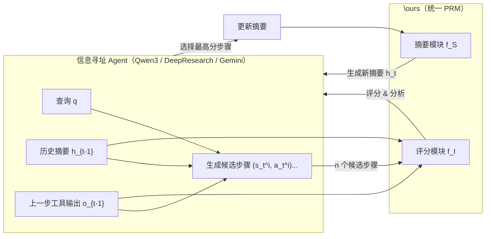

# \ours: Reward Modeling for Long-Horizon Information Seeking — 深度故事化解读

## 1. 研究背景（The World Before）

### 1.1 领域速写：长程信息寻址智能体与过程奖励模型

这篇论文处在“LLM 代理 + 信息检索 + 过程奖励模型（Process Reward Model, PRM）”的交叉地带：

- 一边是基于 LLM 的信息寻址智能体：  
  - 典型框架如 ReAct，将“自然语言推理（Thought）+ 工具调用（Action）”交替执行：
    - 工具包括 Web 搜索、网页浏览、代码执行等。
    - 用于复杂问答、研究、编程、数学等多步任务。
- 另一边是过程奖励模型 PRM：
  - 不只给整条轨迹最终对/错的“结果奖励”（Outcome Reward），而是对每一步推理/行动质量打分。
  - 在测试时，可以对多个候选步骤/轨迹评分，做 best-of-$n$ 选择，从而“以算力换性能”。

目标：  
不修改基础 LLM，只靠一个通用 PRM，在测试时给各种智能体做“过程裁判 + 导航”。

### 1.2 前人工作：已有方法试图解决什么？

1）LLM 作为信息寻址代理

- ReAct 代理被广泛用于：
  - 复杂问答（GAIA）、Web 导航（WebWalkerQA）、研究型任务、数学、软件工程等。
- 为了让代理更会“查资料 + 规划 + 汇总”，很多工作直接微调 LLM：
  - WebSailor / WebShaper / DeepResearch 等利用大量带工具轨迹的数据训练专门的“研究型代理”。
  - 往往需要：
    - 1~10 万级以上训练样本；
    - 昂贵的在线 RL 或多轮 Tool rollout。

2）奖励模型与 PRM

- Outcome Reward Model（ORM）：
  - 对整条推理轨迹打一个“最终正确性”分数，用于：
    - best-of-$n$ 选最佳完整答案；
    - 或做 RLHF。
  - 但无法对中间每一步提供细粒度指导。
- Process Reward Model（PRM）：
  - 对每一步的推理片段打分。
  - 已在：
    - 数学推理（Math-Shepherd, StepWiser, GenPRM）
    - 逻辑推理
    - 部分代理任务（Web-Shepherd, AgentPRM）
    中展现出提升效果。
  - 绝大多数 PRM 的特点：
    - 输入：短的推理片段（1~2 句 CoT），基本不含工具输出。
    - 输出：二元标签（正确/错误）或粗粒度得分。
    - 训练：基于“这一步是否逻辑有效”的标签或偏好。

### 1.3 核心矛盾：为什么这些做法还不够？

论文指出现有 PRM 用在“长程、多工具交互的信息寻址”时会遇到两个核心瓶颈：

1）工具推理粒度不足

- 实际的一步轨迹并不是一小句逻辑推理，而是：
  - 一段较长的自然语言分析 + 某个工具调用（search/browse/code）；
  - 下一步计划。
- 一步的“质量”是多维的：
  - 是否正确理解了工具返回结果？
  - 工具调用本身是否有信息量（informativeness）？
  - 是否减少了不确定性？
  - 是否规划了合理的下一步？
- 但现有 PRM：
  - 只判断“这句推理在数学/逻辑上是否正确”，通常用二元标签。
  - 看不到工具调用本身、也看不到工具输出。
  - 无法给出“多维信息增益”的细粒度评估。

2）上下文爆炸（Context Accumulation）

- 长程信息寻址轨迹 $H_t$ 会快速膨胀：
  - 每一步：长推理 + 工具调用 + 再长的网页/代码输出。
  - 几十步后，context 可以轻易超过 10 万 tokens。
- 这带来两层问题：
  - 计算上：PRM 评估每个候选步骤都要读完整历史，成本巨大。
  - 认知上：模型本身在超长上下文中也会“迷路”，难以聚焦关键证据，评估变得噪声大。
- 但现有 PRM 通常假定：
  - 上下文长度比较短，可以直接整体输入；
  - 未设计专门的“轨迹压缩/摘要”机制。

因此，虽然 PRM 在数学/短推理领域已很成功，但直接迁移到长程信息寻址场景会显得力不从心。

---

## 2. 核心挑战（The Problem）

### 2.1 问题定义

论文要解决的核心问题可以概括为：

“如何构建一个通用的、可生成式的过程奖励模型，使其能够在长程信息寻址任务中：

- 对‘推理 + 工具调用’组成的完整步骤进行多维度质量评估（基于信息增益）；
- 在轨迹不断变长的情况下，通过递归摘要保持可控上下文长度，
  仍能准确判断每一步的价值；

从而在测试阶段，通过 best-of-$n$ 选择显著提升各种智能体（包括开源 LLM、专用研究代理和闭源前沿模型）的信息寻址能力。”

### 2.2 挑战剖析（因果链）

1）因为一步轨迹非常复杂 → 所以简单的“正确/错误”标签不够

- 因为：
  - 一步包含：
    - 理解问题与当前证据；
    - 设计具体工具调用；
    - 对工具输出的解释；
    - 下一步的计划。
  - 任务是否能成功，常常取决于“这一步是否有效地减少了不确定性、缩小了搜索空间”，而不是眼前就答对了什么。
- 所以：
  - 仅凭“这段话逻辑上是不是自洽/有没有算错”并不能评价好坏；
  - 需要一个能够衡量“信息增益”的指标，而这个指标必须考虑完整的“推理 + 工具互动”。

2）因为长程轨迹导致上下文爆炸 → 所以评估质量会迅速下降

- 因为：
  - 每个工具响应都可能是长网页、长代码输出；
  - 多轮步骤后，历史轨迹不仅长，而且充满噪声（无关网页、失败的尝试）。
  - 长上下文会：
    - 让 PRM 难以找出关键证据；
    - 消耗大量算力；
    - 触发 LLM 长上下文退化现象（已被多篇工作证实）。
- 所以：
  - 必须“压缩”历史，将其变成紧凑但信息保留的摘要；
  - 但压缩又不能损坏后续评估所需的关键信息。
  - 如何设计一个既会“裁剪”又懂“什么是重要信息”的机制，是难点。

3）因为标注长程步骤的“好坏”本身很难 → 所以要设计自动化、稳定的监督信号

- 因为：
  - 手工标注每一步“是否有价值”“提高多少成功概率”代价极高；
  - 单步标签（孤立）往往噪声大，不考虑上下文对未来的贡献。
- 所以：
  - 需要自动化标注方案，例如通过蒙特卡洛 rollout 估计“这一步之后再随机走，会多大概率成功”；
  - 并用“偏好对”（preference pair）而不是绝对分，使训练更鲁棒；
  - 同时要处理这些自动标签中的噪声（比如分数差很小的 pair 本身不可靠）。

4）因为我们希望这个 PRM 能提升各种不同代理 → 所以必须“与基础模型解耦”

- 因为：
  - 直接微调每个代理（如 DeepResearch）代价高，且一换 backbone 就要重训。
- 所以：
  - PRM 需要是“模型无关”的：
    - 训练时用自己的数据和 backbone；
    - 测试时面对 Qwen3、DeepResearch、Gemini 等都能直接 plug-in 使用；
  - 这又要求：
    - PRM 对各种风格的推理与工具调用具有较强的泛化能力。

5）一旦解决这些问题 → 将带来什么价值？

- 可以在不动基础大模型参数的前提下：
  - 把一个普通 32B 开源模型，在信息寻址任务上推到接近甚至匹敌更大、更专门训练的前沿系统；
  - 给已经昂贵训练过的“研究代理”再加一层“过程导航”，获得额外收益。
- 这意味着：
  - “测试时扩展 + 通用 PRM”成为提升 agent 能力的一条高效路线；
  - 和“针对每个模型做大量微调”的思路形成互补。

---

## 3. 核心洞见（The Finding / Insight）

### 3.1 颠覆性视角：把“步骤好不好”看作“信息增益”问题，并交给一个同时会“评估”和“整理历史”的生成式 PRM

作者的核心洞见可以概括为两点：

1）步骤质量 = 信息增益

- 不再把“好的一步”简单等同于“逻辑上正确的一句推理”；
- 而是从“任务成功概率”的角度看：
  - 好的一步，是那种“执行完这一步后，从当前状态出发，再随机搜索，也更容易最终答对”的步骤；
  - 也就是：这一步在整体上提升了“到达正确答案的可能性”——即信息增益。
- 这样就自然把复杂的多维质量（工具调用是否信息丰富、对输出解读是否合理、是否收敛到真正未知变量……）都统一折叠到一个“改善成功概率”的标量上。

2）PRM 既是裁判也是记录员：用同一个模型既做“信息增益评分”，又做“轨迹摘要”

- 传统做法：
  - 评估和摘要是分离的：评估模型只负责打分，上下文由外部手写规则截断或简单缓存。
- 作者的洞见：
  - 评估“这一步有没有信息增益”，与“历史上哪些信息是关键”其实高度耦合；
  - 因此，不如让同一个 PRM 在每一步：
    - 先读入上一轮摘要 + 最新工具输出 + 当前推理/工具调用；
    - 输出：
      - 一个新的、更精炼的摘要（代表对历史的“重写理解”）；
      - 以及对当前步骤的信息增益评分（伴随一段 CoT 分析）。
- 这样，“如何压缩历史”就不再是静态规则，而是随着模型对任务结构理解的加深，在训练中自适应学到的。

### 3.2 逻辑桥梁：如何把“棘手的长程评估问题”变成“可解的局部估计问题”？

整个逻辑链大致是：

1）把任务拆成多步轨迹 $H_t$，并定义每一步的“信息增益分数” $g_t$

- 利用 Monte Carlo rollout：
  - 在某一步前，采样 $M$ 条后续轨迹，估计“当前状态下最终答对的概率” $m_{t-1}$；
  - 在加上当前候选步骤 $(s_t,a_t)$ 后，再采样 $M$ 条后续轨迹，估计 $m_t$；
  - 定义 $g_t = (m_t - m_{t-1}) \times M/2$，约束在 $[-M/2, M/2]$。
- 因为：
  - $m_t - m_{t-1} > 0$ 就意味着“这一步总体上有帮助”，反之则有害。
- 所以：
  - 我们获得了一个可以自动计算的、连续的“局部贡献”指标。

2）基于这些分数构造“偏好对”，并让 PRM 学会“谁更好”

- 对于某一步，利用 rollout 找出：
  - 一条“最短且成功”的轨迹中的那一步，作为候选赢家；
  - 再随机选出一个对比的步骤（不成功或更长的成功）。
- 然后重新用 Monte Carlo 对这两个步骤分别估计 $g^+$、$g^-$，以真实分数重排谁赢谁输。
- 因为：
  - 偏好学习（preference learning）比单点回归更鲁棒；
- 所以：
  - PRM 能在“谁更有信息增益”上学到更稳定的排序能力。

3）联合两个目标：绝对分数拟合 + 相对偏好排序

- PRM 输出预测分 $\hat{g}$，训练时同时优化：
  - Score Reward：让 $\hat{g}$ 接近真实信息增益 $g$；
  - Comparison Reward：在偏好对中确保“赢的步”预测分高于“输的步”。
- 再利用“真实分差 $(g^+ - g^-)/M$”作为权重 $w$，对偏好损失加权：
  - 分差大 → 这对偏好更可靠 → 权重大；
  - 分差小 → 更可能只是噪声 → 权重小。
- 所以：
  - 把 noisy 的自动标注转化为相对稳健的学习信号。

4）同时训练“摘要能力”，把历史 $H_t$ 压缩成 $h_t$

- 使用另一个 LLM（Qwen3-32B）作为 teacher，为数据中的每一步生成：
  - 一个递归摘要：$h_t = \text{LLM}(q, h_{t-1}, o_{t-1}, s_t, a_t)$。
- PRM 在 SFT 阶段学会：
  - 给定 $(q, h_{t-1}, o_{t-1}, s_t, a_t)$ 生成 $\hat{h}_t$，模仿 teacher 摘要。
- 因为：
  - 摘要中只保留“确证事实、仍存疑点、已放弃假设、下一步计划”等关键信息；
- 所以：
  - 之后评分时，PRM 只需读摘要 $h_{t-1}$ + 当前 tool 输出 + 步骤即可，既省算力又降噪。

5）通过交替 SFT + GRPO 训练一个统一模型

- 交替进行：
  - SFT：训练 PRM 生成优质摘要；
  - GRPO：基于偏好对训练 PRM 输出高质量评分。
- 这使得：
  - PRM 对“什么是重要信息”与“什么是好步骤”形成闭环互相促进的认知。
- 最终：
  - 在测试时，面对任何代理产生的候选步骤，PRM 都能：
    - 用自己的摘要维护一个紧凑的“历史世界模型”；
    - 用评分评估每个候选步骤对信息增益的贡献；
    - 支持 best-of-$n$ 选择。

这种“信息增益视角 + 联合摘要与评分”的洞见，把原来难以直接建模的长程信息寻址评估，变成了一个“可自动标注、可局部近似”的问题。

---

## 4. 实现方法（The “How”）

### 4.1 总体架构

可以用下图来概括 \ours 的角色：

- Agent（任意 LLM）负责：
  - 从摘要 + 上一轮工具输出出发，采样多个候选步骤（推理 + 工具调用）。
- \ours 负责：
  - 基于当前摘要 + 最新工具输出，对每个候选步骤生成：
    - 一段多维分析 CoT；
    - 一个信息增益评分；
  - 选出得分最高的步骤作为真实执行步骤；
  - 再将“上一摘要 + 当前步骤 + 最新工具输出”压缩成新的摘要。

### 4.2 数据流与输入输出

1）输入数据类型：

- 查询 $q$；
- 历史摘要 $h_{t-1}$（递归压缩后的历史）；
- 最新工具输出 $o_{t-1}$；
- 当前待评估步骤 $(s_t, a_t)$：
  - $s_t$：自然语言推理；
  - $a_t$：工具调用（例如 JSON 格式的 search/browse/code 调用）。

2）PRM 作为 scorer 的 I/O：

- 输入：$(q, h_{t-1}, o_{t-1}, s_t, a_t)$；
- 输出：
  - 生成式 CoT 分析（包括评价标准、逐项分析）；
  - 最终在文本中给出一个 `\boxed_score{X.Y}` 的标量预测 $\hat{g}_t \in [-M/2, M/2]$。

3）PRM 作为 summarizer 的 I/O：

- 输入：$(q, h_{t-1}, o_{t-1}, s_t, a_t)$；
- 输出：
  - 一段新的摘要文本 $\hat{h}_t$（包含：
    - 已确证知识
    - 未决问题
    - 过去假设/行动
    - 当前假设与下一行动等）。

### 4.3 关键模块与训练步骤

#### 4.3.1 轨迹与信息增益预备定义

- 轨迹 $H_t$ 定义为：
  - $H_t = (s_1,a_1,o_1,\dots,s_t,a_t,o_t)$；
- Agent 策略：$s_t, a_t \sim \pi(\cdot | q, H_{t-1})$；
- 最终答案 $o_T$ 与标准答案 $a^*$ 匹配则任务成功。

信息增益分数：

- 对于某一步 $(s_t, a_t)$：
  - 先在 $H_{t-1}$ 基础上 rollout $M$ 次，得到最终答案集合，平均正确率 $m_{t-1}$；
  - 再在 $H_{t-1}$ 加上这一步后 rollout $M$ 次，得到 $m_t$；
  - 定义：
    - $$g_t = (m_t - m_{t-1}) \times \frac{M}{2}$$
- 含义：
  - $g_t > 0$：这一步整体上提升成功率；
  - $g_t < 0$：这一步整体上拉低成功率；
  - $|g_t|$ 大小反映贡献强度。

#### 4.3.2 偏好对构造与标注流水线

这一步用来生成训练 PRM 的 “(winning, losing) step pairs”。

- 对每个时间步 $t$：
  - 令当前状态为 $(q, H_t)$；
  - 采样 $M$ 条后续轨迹：
    - 得到 $M$ 个候选下一步 $(s_{t+1}^{(j)}, a_{t+1}^{(j)})$ 和各自最终答案。
- 构造候选偏好对：
  - 选出：
    - 一条“成功且长度最短”的轨迹中的下一步作为临时 winner；
    - 再随机从其他 $M-1$ 条中挑一个作为 loser 候选。
- 对这对候选步骤分别做信息增益标注：
  - 把每个步骤当作起点，重新 rollout $M$ 次，计算 $g_{t+1}^{(1)}, g_{t+1}^{(2)}$；
  - 以更高分的为真正 winner $(s_{t+1}^+, a_{t+1}^+)$，另一为 loser $(s_{t+1}^-, a_{t+1}^-)$。
- 对后续步继续重复：winner 所在轨迹的下一步再与别的候选构造新的偏好对。

同时，为每个步骤生成摘要标签：

- 使用强模型（Qwen3-32B）作为“摘要 teacher”：
  - $$h_t = \text{LLM}(q, h_{t-1}, o_{t-1}, s_t, a_t)$$
- h_t 是到当前步为止的完整“信息寻址状态摘要”。

最终得到的数据集包含：

- 若干问题 $q$；
- 对每一问题的多个时间步 $t$：
  - Winning / losing 步骤 $(s_t^+,a_t^+), (s_t^-,a_t^-)$；
  - 对应的信息增益分数 $g_t^+, g_t^-$；
  - 摘要标签 $h_t^+, h_t^-$。

#### 4.3.3 PRM 评分能力训练（GRPO）

记 PRM 的评分函数为：

- $$\hat{g}_t = f_I(q, h_{t-1}, o_{t-1}, s_t, a_t)$$

使用 GRPO（Group Relative Policy Optimization）强化学习风格训练：

1）Score Reward（绝对分回归）

- 对每个样本（无论赢/输）定义：
  - $$r_s^k = 1 - \left|\frac{g^k - \hat{g}^k}{M}\right|,\quad k\in\{+,-\}$$
- 预测越接近真实分，奖励越高。

2）Comparison Reward（偏好排序）

- 在训练中对每对 (win, lose) 做多次 rollout，得到多次预测 $\hat{g}^{k}_j$；
- 对每次 rollout 的某个样本（+ 或 -）定义：
  - $$r_c^k = \frac{1}{N} \sum_{j=1}^{N} y^k \cdot \text{sign}(\hat{g}^k - \hat{g}^{\bar{k}}_j)$$
  - 其中 $y^+ = 1, y^- = -1$，$\bar{k}$ 是对方；
  - 如果 PRM 预测 winner 的分数总是比 loser 高，则 reward 为正。
  
3）自适应权重合成

- 对每对样本定义权重：
  - $$w = \frac{g^+ - g^-}{M}$$
  - 分差越大，偏好越可信。
- 最终 rollout 奖励：
  - $$r^k = r_s^k + w \cdot r_c^k$$

这样同时鼓励：

- 分数回归准确；
- 排序正确，且对分差大的 pair 给予更大学习力度，从而减弱标注噪声影响。

#### 4.3.4 PRM 摘要能力训练（SFT）

摘要函数：

- $$\hat{h}_t = f_S(q, h_{t-1}, o_{t-1}, s_t, a_t)$$

训练方式：

- 纯监督微调（SFT）：
  - 以 teacher 生成的 $h_t$ 为 gold，优化交叉熵。
- 摘要结构：
  - 统一模板，如：
    - Confirmed Knowledge
    - Uncertainty
    - Previous Hypotheses
    - Current Hypotheses
    - Previous / Current Actions
  - 可以看作是间接教模型“如何组织信息寻址状态”。

#### 4.3.5 交替训练策略

- 训练过程采用循环：
  - 先用一轮 SFT 更新摘要能力；
  - 再用一轮 GRPO 更新评分能力；
  - 重复若干轮。
- 好处：
  - 摘要能力增强 → 评分时看到的历史状态更干净、更结构化；
  - 评分能力增强 → 反向影响模型对“什么是关键信息”的敏感性，间接提升摘要效果。

### 4.4 测试时如何使用 \ours 指导智能体？

对任意 Agent（Qwen3-32B / DeepResearch-30B-A3B / Gemini-2.5-Flash）：

1）在每一步 $t$：

- Agent 根据 $(q, h_{t-1}, o_{t-1})$ 产生 $n$ 个候选步骤 $(s_t^{(i)}, a_t^{(i)})$。

2）对每个候选步骤调用 PRM scorer：

- 输入 $(q, h_{t-1}, o_{t-1}, s_t^{(i)}, a_t^{(i)})$；
- 得到评分 $\hat{g}_t^{(i)}$。

3）选择：

- 取得分最高的候选步骤作为真正执行的步骤；
- 调用对应工具得到 $o_t$。

4）更新摘要：

- 用 PRM summarizer：
  - $h_t = f_S(q, h_{t-1}, o_{t-1}, s_t^{\text{chosen}}, a_t^{\text{chosen}})$；
- 进入下一步。

这样，PRM 实时充当“裁判 + 记分员 + 记录员”，对每一步给出细粒度、信息增益导向的决策。

---

## 5. 实验与结论（The Proof）

### 5.1 实验设置

1）智能体（基础模型）

- Qwen3-32B（开源强推理模型）；
- Tongyi DeepResearch-30B-A3B（专门训练的长程信息寻址代理）；
- Gemini-2.5-Flash（闭源前沿模型）。

2）基准数据集

- GAIA（Level 1/2/3）：复杂检索和多步推理的一般助手评估。
- WebWalkerQA（Easy/Medium/Hard）：必须浏览网页寻找证据的问答任务。
- FRAMES：强调事实与推理结合、需要多次工具交互的 QA。

3）评价方式

- LLM-as-Judge（LasJ），由 GPT-5 判定最终答案是否正确；
- 每个配置跑 3 次，报告 Avg@3；
- 评估的是“在每一步使用 best-of-$n$（默认 $n=4$）指导时，整体任务成功率”。

4）基线方法

- Base agent：无任何 PRM 指导的原始 Agent。
- 内在启发式：
  - Confidence：根据模型概率（负平均 log prob）估计信心；
  - Relevance：基于 Jaccard 相似度评估当前步与历史的语义相关；
  - Verbal-progress：让一个模型打 1~5 分表示“离完成还差多远”。
- 现有 PRM：
  - GenPRM-7B（数学 PRM，输出 yes/no）；
  - Web-Shepherd-8B（生成 checklist 并打“已完成/未完成/进行中”）；
  - StepWiser：我们用同样数据、Qwen3-4B 重实现，训练方式与原论文一致，但用于信息寻址任务。

5）\ours 细节

- PRM backbone：Qwen3-4B；
- 训练数据：
  - ≈ 2k 对偏好样本（来自约 4k 多信息寻址问题）、每步 8 个 rollout 标注信息增益；
- 训练方式：
  - 交替 SFT（摘要）和 GRPO（评分）；
  - GRPO rollout 数 $N=4$。

### 5.2 核心结果

1）在开源基础模型 Qwen3-32B 上

- 总体平均：
  - Base agent：29.5；
  - 最佳基线（Confidence）：32.8；
  - \ours：38.8（+9.3 个百分点，相比 Base）。
- 典型数据点：
  - GAIA Level 1：
    - Base：35.1 → \ours：49.6（+14.5）；
  - GAIA Level 2：
    - Base：23.7 → \ours：33.3（+9.6）；
  - WebWalkerQA Easy：
    - Base：30.1 → \ours：39.8（+9.7）。
- 对比 StepWiser（同数据、同尺寸）：
  - StepWiser 仅从 29.5 → 31.0（+1.5）；
  - 说明：
    - 简单“这一步有效/无效”的二元标签 + 不带摘要的 PRM 对长程 info-seeking 的增益远不如“信息增益 + 摘要”的设计。

2）在专用信息寻址代理 DeepResearch-30B-A3B 上

- 总体平均：
  - Base agent：62.9；
  - 最佳其他基线：64.2；
  - \ours：66.8（+3.9）；
- 关键子集：
  - GAIA Level 3（最难）：
    - Base：41.7 → \ours：44.5；
  - WebWalkerQA Hard：
    - Base：68.0 → \ours：70.1。
- 对标前沿大模型（来自 DeepResearch 论文）：
  - OpenAI DeepResearch：67.4；
  - DeepSeek-V3.1-671B：63.1；
  - 我们：DeepResearch-30B-A3B + \ours：64.4（GAIA 平均）。
- 这说明：
  - 在已有昂贵训练的“研究代理”之上，加一个 4B PRM 仍能获得实质性增益；
  - 以小成本接近甚至逼近更大规模系统的性能。

3）在闭源前沿模型 Gemini-2.5-Flash 上

- GAIA 平均：
  - Base：40.0；
  - 最佳其他基线：41.5；
  - \ours：44.0（+4.0）。
- GAIA Level 3：
  - Base：19.5 → \ours：25.0（+5.5）。

结论：\ours 在三种截然不同的 agent 上都能稳健提升性能，并在难度最高的子集（GAIA-L3、WebWalkerQA-Hard）尤为明显。

### 5.3 补充发现与分析

1）摘要带来的收益：压缩比“直接丢历史”更有效

- 对比不同上下文策略：

  - 只给最近一步 $H_{-1:}$；
  - 最近两步 $H_{-2:}$；
  - 最近四步 $H_{-4:}$；
  - 整个原始历史 $H_t$；
  - 摘要 $h_t$（\ours）。
- 结果：
  - $H_{-2:}$ 在截断类方法里最好，但仍不及摘要；
  - $H_t$（全历史）反而最差。
- 平均准确率：
  - 全历史 $H_t$：39.5；
  - 摘要 $h_t$：47.2（+7.7）。
- 说明：
  - 上下文越长并不代表信息越充分，噪声和无关内容会严重干扰 PRM 判断；
  - 结构化、递归的摘要能在保留关键信息的同时显著降噪。

2）奖励设计：score + comparison + 自适应权重缺一不可

- 只用 score reward（分数拟合）：
  - 平均 44.2；
- 只用 comparison reward（偏好排序）：
  - 平均 43.1；
- 简单相加 $r_s + r_c$：
  - 平均 46.2；
- 加上自适应权重 $r_s + w \cdot r_c$（\ours）：
  - 平均 47.2。
- 说明：
  - 绝对分与排序信号是互补的；
  - 用真实分差控制偏好损失权重能有效抑制噪声 pair 的影响。

3）test-time compute scaling：\ours 随 best-of-$n$ 放大收益

- 在 GAIA Level 2，Qwen3-32B，vary $n \in \{1,2,4,8,16\}$：
  - 随 $n=2,4,8$，\ours 的准确率持续上升，最大提升达 +8.9；
  - $n=16$ 时出现回落，被解释为“过度探索”：
    - PRM 在高 $n$ 时更频繁选择“继续查资料”的步骤，即使已经有正确答案，也迟迟不提交。
- 对比 StepWiser：
  - 提升微弱，甚至不稳定。
- 这进一步验证：
  - 基于信息增益的细粒度评分让 \ours 能充分利用额外采样，挖掘“更有信息量”的步骤。

4）数据规模：约 1k pair 就能显著超越 Base

- 数据量缩放实验（以 GAIA Level 2 为例）：
  - 使用 25%、50%、100%、150% 的标注数据；
  - 在 ≈1k pair（50%）时，性能已明显超过 Base；
  - 之后收益逐渐饱和。
- 对比需要 10k~100k 轨迹的代理微调方法，\ours 显示出很强的数据效率。

5）联合模型比分模块模型更好

- 把“摘要”和“评分”分给两个模型：
  - 摘要用 teacher（Qwen3-32B）在测试时现算；
  - PRM 只负责评分；
- 结果不如 \ours 这种“统一模型 + 交替训练”的方案。
- 说明：
  - 同一个模型“理解什么是关键信息”和“理解什么是好步骤”是互相促进的；
  - 信息抽取和质量评估共享参数更利于抽象统一的 task schema。

---

## 6. 局限性分析（Limitations）

### 6.1 潜在弱点

1）标注成本仍然不低

- 每个步骤信息增益的估计需要：
  - Monte Carlo rollout $M=8$；
  - 对 winner/loser 各自再做 $M$ 次；
- 虽然比为每个大模型做在线 RL 便宜，但对大规模扩展仍有一定成本。

2）依赖于一个强大的 teacher 生成摘要与分数

- 所有标注（信息增益估计、摘要）都基于 Qwen3-32B 的 agent 行为；
- 如果 teacher 质量不高，可能：
  - rollout 的成功率估计不可靠；
  - 摘要中的信息组织偏差会传给 PRM。

3）Beam-search 风格的 best-of-$n$ 仍然受限于初始候选质量

- PRM 只在“候选步骤集合”中打分；
- 如果 agent 产生的候选本身都很差（比如没想到关键工具），PRM 也只能在“差中择优”。

4）过度探索风险

- 在 $n$ 较大时，PRM 倾向于选择“继续探索/查资料”的步骤；
- 若没有额外“停止/提交”机制，可能导致：
  - 即便已具备解题信息，也一直不输出最后答案。

### 6.2 隐含前提与失效场景

1）前提：信息增益可通过有限次 rollout 可靠估计

- 假设通过 $M=8$ 的 rollout 就能稳定估计 $m_t$；
- 在极复杂任务或高 variance 场景中，这个估计可能非常 noisy；
- 虽有偏好和权重机制缓解，但在极端任务上可能不足。

2）前提：任务数据分布相对稳定

- PRM 在训练中见到的任务类型、工具环境与测试相近：
  - QA + Web 搜索/Browse + Code；
- 若部署到完全不同的工具生态（如企业内部 API、复杂工作流），摘要和评分准则可能需要再训练或适配。

3）前提：Agent 的推理风格大体类似

- 虽然实验表明对不同 LLM 有不错泛化；
- 但若 agent 使用极端不同的 prompting 风格、工具调用接口格式，PRM 可能需要 prompt 级适配。

---

## 7. 未来探索（Future Work）

### 7.1 直接扩展方向

1）更丰富的工具生态与多模态信息寻址

- 当前主要针对文本工具（搜索、浏览、代码）。
- 可扩展到：
  - 图像/视频检索、文献库、知识图谱调用等；
  - 让 PRM 学会评估“多模态工具调用”的信息增益。

2）端到端联合训练 Agent + PRM

- 目前 PRM 独立训练，用于测试时指导；
- 可以探索：
  - 在 RL 训练 Agent 时使用 \ours 评分作为 dense reward；
  - 形成双向协同：Agent 学着产出高信息增益的步骤，PRM 再进一步精化。

3）更精细的停止/提交策略

- 在 best-of-$n$ 中显式建模：
  - 什么时候应该停止探索、提交答案；
- 可以把“提交动作”本身当作一个特殊工具调用，由 PRM 评估其“期望收益”。

4）降低标注成本

- 使用自监督或多任务学习进一步减少对 Monte Carlo rollout 的依赖；
- 或用少量人工标注高质量对照数据，对自动标注进行偏差校正。

### 7.2 启发性迁移与个人研究启示

1）迁移到系统运维 / AIOps 场景

- 在 AIOps 中，“一步操作”的质量也可以被理解为“对问题定位/恢复成功率的信息增益”：
  - 例如一次日志检索/监控查询/拓扑探测；
- 可以仿照 \ours：
  - 用 Monte Carlo 模拟故障排查流程，估计每一步操作带来的“定位成功率提升”；
  - 训练 PRM 作为“运维操作策略”的过程裁判；
  - 同时维护一个“故障排查摘要”，压缩长日志和操作历史。
- 这对“智能运维代理”的可解释决策和安全性都非常重要。

2）将“信息增益 PRM + 摘要”思想应用于 OS 级多进程决策

- 在操作系统资源调度、自动调参、故障隔离等复杂任务中：
  - 每次调度/迁移/隔离也是一步“行动”；
  - 可以定义类似“系统健康度或 SLA 保障概率”的信息增益；
- 用统一 PRM 判断：
  - 某次调度动作是否有效减少了不确定性、提高了 SLA 满足概率；
  - 并通过摘要机制维护“系统状态的压缩记忆”。

3）更一般的“过程裁判 + 世界摘要”范式

- \ours 展示了一种通用模式：
  - 对长程任务：
    - 用一个模型同时做“世界状态的递归摘要”和“每一步动作的信息增益评估”；
- 这可迁移至：
  - 复杂多轮对话系统；
  - 多智能体协作任务（每个 agent 的发言/动作对团队目标的信息增益）；
  - 自动科研代理（每个实验设计/文献查找对最终结论的增益）。
  
---

## 关键术语表

- Information-seeking agent（信息寻址代理）  
  利用 LLM 作为大脑，通过外部工具（搜索、浏览、代码执行等）逐步收集、整合信息来回答复杂问题的智能体。  
  例子：给代理一个 GAIA 问题“2010 年后某国模拟电视关停后的数字电视发射台情况？”，它多次搜索、打开网页、读法规，最后整理出答案。

- ReAct（推理-行动交替框架）  
  一种代理框架，将“自然语言推理（Thought）”和“工具调用（Action）”交替执行。  
  例子：  
  - Thought：我需要查这位作曲家的生平；  
  - Action：调用 web_search("作曲家 名字 生平")。

- Outcome Reward Model, ORM（结果奖励模型）  
  对完整推理/交互轨迹输出一个结果分数，通常是“是否答对”。  
  例子：给整条 CoT + 答案，ORM 输出“0.9”表示有 90% 可能正确。

- Process Reward Model, PRM（过程奖励模型）  
  对推理过程中的每一步进行打分，以指导中间步骤的选择。  
  例子：在多步解方程过程中，PRM 判断“这一步把方程整理成标准形式”是有帮助的，打高分；“这一步误把 + 写成 -”打低分。

- Information gain（信息增益）  
  在本论文中指：某一步之后，“到达正确答案的预期成功率”相对于这一步之前的提升量。  
  例子：  
  - 这一步前，多次随机继续推理，平均成功率是 0.5；  
  - 加上这一步后，再随机继续，成功率变成 0.75；  
  - 则信息增益为 $(0.75 - 0.5) \times M/2$。

- Monte Carlo rollout（蒙特卡洛回滚）  
  从当前状态开始，让 agent 随机继续执行若干完整轨迹，以估计某种期望值（如成功率）。  
  例子：在某一步后，用相同策略生成 8 条后续轨迹，统计其中有多少条答对问题。

- Preference pair（偏好对）  
  由两个候选步骤组成的训练样本，其中一个被标为“更好（winning）”，另一个“较差（losing）”。  
  例子：  
  - Winning：查找“St John’s College 1820 Chief Justice position”，精准包含时间和机构；  
  - Losing：只查“James Wood Cambridge position”，缺少关键时间点，被标为较差。

- GRPO（Group Relative Policy Optimization）  
  一种强化学习优化方法，与 PPO 类似，但利用组内相对表现进行归一化，以稳定训练。  
  例子：对同一状态下多个 PRM 输出进行比较，奖励高于组均值的样本。

- Trajectory summary（轨迹摘要）  
  对当前为止的整个信息寻址过程（多步推理 + 工具交互）的压缩描述，保留关键事实、假设、未解决问题和下一步计划。  
  例子：  
  - 确认：作者是某位作曲家；  
  - 未知：其 1965 年在某城市的活动；  
  - 下一步：搜索“作曲家 名字 1965 July City”。

- Best-of-$n$ sampling（多候选四优）  
  在每一步生成 $n$ 个候选步骤，由 PRM 打分，选分数最高的那个执行。  
  例子：在信息不足时，生成 4 种不同的搜索查询，PRM 判定哪个最可能缩小搜索空间，就选哪个。

- LLM-as-Judge（LLM 评审）  
  用一个大模型作为裁判来打分/判定其它模型输出的正确性。  
  例子：在 GAIA 评测中，用 GPT-5 来对各代理的最终答案是否合理下裁决。

- Trajectory context $H_t$（轨迹上下文）  
  到第 $t$ 步为止的完整推理与工具交互序列：$(s_1,a_1,o_1,\dots,s_t,a_t,o_t)$。  
  例子：包含所有 Thought 文本、所有搜索调用参数以及每次搜索返回的网页片段。

- Summary $h_t$（摘要状态）  
  由 \ours 递归维护的压缩版轨迹状态，长度被控制在合理范围内，但包含完成后续评估所需的关键信息。  
  例子：一段 10~20 句的结构化描述，而不是上万 token 的原始网页内容。